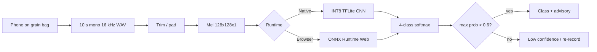

# Kaan (कान): Technical Methodology and Paper Content Pack

**Working title (workshop):** Leakage-aware multi-approach acoustic classification of stored-rice pests for offline phone deployment  
**System name:** Kaan (कान)  
**Author:** Arnav Dhiman  
**Licence:** Apache License 2.0  
**Code:** https://github.com/arnavd371/Project-Kaan  
**Live demo:** https://kaan-web.vercel.app  
**Document status:** Paper content pack (methods + results + claims). Not a submitted manuscript.

---

## 1. Abstract (draft)

Stored-grain insects cause large post-harvest losses in India, yet early infestation is hard to see because pests often feed inside kernels. Commercial acoustic probes exist but are expensive for smallholders. We present **Kaan**, an offline phone workflow that records contact audio against a storage bag, converts it to a mel spectrogram, and classifies four classes (`clean`, rice weevil, lesser grain borer, red flour beetle) with a compact INT8 CNN. Beyond the deployed model, we run a **leakage-aware, file-level, multi-seed bake-off** of eleven approaches (mel CNNs, a 1D CNN, a YAMNet linear probe, and classical models on handcrafted features) against the cited Balingbing et al. (2024) reference accuracy of **84.51%**. On byte-deduped IRRI pest WAVs plus Speech Commands ambient windows for `clean`, strong handcrafted models (e.g. gradient boosting **95.36% ± 1.50**) match a deep mel-CNN (**95.15% ± 0.48**); bootstrap 95% CIs for these means sit above 84.51%. Ablations show that a bare deep-CNN training recipe can collapse, while SpecAugment / class weights / label smoothing leave-one-outs remain high on a single seed. We release code, audits, findings (McNemar, confusions, SNR proxy), and an offline multilingual web app. Limits: soft claim vs the cited reference number (not a locked reimplementation); no large Indian phone-mic field corpus yet.

---

## 2. Contributions

1. **Open offline tool:** INT8 / ONNX mel-CNN pest screen for phones, multilingual advisories, no upload required for classification.  
2. **Leakage-aware evaluation protocol:** file-level stratified splits, byte-dedupe before split, before/after training audits.  
3. **Same-split multi-approach bake-off:** eleven approaches, three seeds (42/43/44), accuracy + macro-F1, bootstrap CIs, tests vs 84.51%.  
4. **Training-recipe evidence:** strong CNN recipe vs baseline collapse; ablations and error analysis (weevil ↔ lesser grain borer).  
5. **Honest deployment framing:** screening aid; confidence gate; stated domain-shift limits.

---

## 3. Problem and threat model

### 3.1 Operational problem

- India stores large volumes of food grain; insects drive substantial storage losses (IGMRI, 2015; cite ~₹1,300 crore/year as in project materials).  
- Primary pests in scope: *Sitophilus oryzae* (rice weevil), *Rhyzopertha dominica* (lesser grain borer), *Tribolium castaneum* (red flour beetle).  
- Early feeding is often **cryptic** (inside kernels): visual inspection and casual listening scale poorly.  
- Lab acoustic systems and dedicated probes are costly for smallholders.

### 3.2 What Kaan is / is not

| Is | Is not |
|---|---|
| Offline screening aid on phone contact audio | Lab diagnosis or legal certification |
| Four-class taxonomy above | Pulse beetle / legume pests / all insects |
| Soft comparison to cited 84.51% on **own** protocol | Locked reimplementation of Balingbing’s exact pipeline |
| Workshop evidence package | Field RCT of farmer outcomes |

### 3.3 Objection: “Won’t farmers just listen?”

Counter used in the project narrative (not a psychophysics claim):

- Absolute human hearing sensitivity is **not** claimed to be worse than a phone mic.  
- Claim is **task performance**: early bag-coupled feeding is sparse, ambiguous across species, and inconsistent under farm noise; contact recording + fixed protocol + classifier supports **species-level screening at scale**.  
- Late/loud infestation may be audible; the product targets earlier, quieter, class-level decisions plus advisory text.

---

## 4. Related work (skeleton for paper)

Fill with full citations when drafting:

1. **Acoustic stored-product insect (SPI) detection** — Hagstrum, Mankin, and related reviews; probe / piezoelectric / acoustic emission systems.  
2. **Balingbing et al. (2024)** — multi-layer CNN on acoustic device recordings for major stored-rice pests; cited validation accuracy **84.51%** used as reference *line*, not shared code lockstep.  
3. **Edge / on-device ML** — TFLite INT8, ONNX Runtime Web, SpecAugment (Park et al.).  
4. **Agri-AI / ML for development** — deployment under connectivity and cost constraints.  
5. **Classical audio features** — MFCC / spectral summaries still competitive on small bioacoustic sets.

---

## 5. System overview



**Privacy:** classification audio stays on device / in browser for inference.  
**UI languages:** English, Hindi, Marathi, Punjabi, Telugu.  
**Hosting:** Vercel static `web/`; model weights shipped to client.

---

## 6. Data

### 6.1 Sources

| Role | Source | Notes |
|---|---|---|
| Pest WAVs | IRRI Rice Acoustic Sensor Dataset (Balingbing et al., 2024; GitHub `cbalingbing/Rice-Acoustic-Sensor`) | Mapped to weevil / lesser grain borer / red flour beetle folders |
| Clean | Google Speech Commands v0.02 `_background_noise_` | Real ambient noise windows, not synthetic silence |
| Optional pink | Training-time / prep extras | Controlled SNR augmentation, not the sole clean class |

Clean training/validation file split used in Kaggle prep (illustrative of protocol): e.g. dishes / miaowing / exercise bike for train windows; running tap held out for val-style ambient (see `model/train_kaggle.py` / `experiments/prepare_kaggle_data.py`).

### 6.2 Classes

| ID | Label | Species |
|---|---|---|
| 0 | `clean` | No pest (ambient / background) |
| 1 | `rice_weevil` | *Sitophilus oryzae* |
| 2 | `lesser_grain_borer` | *Rhyzopertha dominica* |
| 3 | `red_flour_beetle` | *Tribolium castaneum* |

### 6.3 Audio canonicalization

| Parameter | Value |
|---|---|
| Sample rate | 16_000 Hz mono |
| Window length | 10.0 s → 160_000 samples |
| Silence trim | `librosa.effects.trim`, `top_db=20` |
| Length fix | Center crop or zero-pad to exactly 10 s |

### 6.4 Deduplication and leakage control

1. Collect paths under `data/{class}/*.wav`.  
2. **Byte-dedupe** identical files before split (MD5 of file bytes).  
3. **File-level** stratified train/val split (`test_size=0.2`, seeds 42/43/44).  
4. **Audit (before training):** zero path overlap train↔val; no byte twins across split; mel duplicate checks; class counts; TF/GPU.  
5. Persist `split_manifest.json` and `dedupe_report.json`.  
6. **Audit (after training):** prediction diversity, vs reference, confusion diagonals, CNN learning-curve summary.

Workshop multi-seed runs used **316** validation files per seed after prep/dedupe (see findings error denominators).

---

## 7. Features

### 7.1 Mel spectrogram (CNN path)

| Parameter | Value |
|---|---|
| `n_mels` | 128 |
| `n_fft` | 2048 |
| `hop_length` | 512 |
| Power → dB | `librosa.power_to_db(..., ref=np.max)` |
| Normalization | Min–max to [0, 1] per spectrogram |
| Resize | Zoom / pad to **128 × 128 × 1** |

Acoustic motivation (product copy / literature alignment): feeding energy often discussed in roughly **300–4000 Hz**; lesser grain borer peaks cited near **355–371 Hz** in project docs (cite primary sources in the paper).

### 7.2 Handcrafted vector (~74-D)

Built in `experiments/features.py`:

- MFCC (20): mean + std → 40  
- Spectral centroid, bandwidth, rolloff: mean + std each → 6  
- Zero-crossing rate, RMS: mean + std each → 4  
- Chroma STFT (12): mean + std → 24  
- **Total ≈ 74** dimensions  

Shared by: `svm_rbf`, `mlp`, `gbdt`, `rf`, `extratrees`, `knn`, `logreg`.

### 7.3 Waveform for YAMNet probe

Raw 10 s mono floats, peak-normalized, passed to frozen YAMNet; **mean-pool** frame embeddings → logistic regression.

---

## 8. Models and training

### 8.1 Approach catalogue

| ID | Family | Input | Description |
|---|---|---|---|
| `cnn_shallow` | Mel CNN | 128×128×1 | Production-style CNN (`model/train.py`) |
| `cnn_deep` | Mel CNN | 128×128×1 | Deeper v5 (`model/train_kaggle.py`) |
| `cnn1d` | 1D CNN | mel as (T=128, F=128) | Conv1D over time; freq as channels |
| `yamnet_probe` | Pretrained | waveform | Frozen YAMNet + logistic probe |
| `svm_rbf` | Classical | handcrafted | RBF SVM, `C=10`, balanced |
| `mlp` | Classical | handcrafted | MLP (128, 64), early stopping |
| `gbdt` | Classical | handcrafted | HistGradientBoosting |
| `rf` | Classical | handcrafted | RandomForest, balanced_subsample |
| `extratrees` | Classical | handcrafted | ExtraTrees, balanced_subsample |
| `knn` | Classical | handcrafted | k-NN (k=7), distance weights |
| `logreg` | Classical | handcrafted | Balanced logistic regression |

**Deployment note:** the live app still ships the existing INT8/ONNX mel-CNN path. Experiments compare approaches; they do not auto-replace production weights.

### 8.2 Mel-CNN architectures (conceptual)

**Shallow (`cnn_shallow`):** Conv32 → BN → Pool → Conv64 → BN → Pool → Conv128 → BN → GAP → Dense128 → Dropout0.4 → Softmax4.  
**Deep (`cnn_deep` v5):** paired Conv blocks 32/32, 64/64, 128/128 with BN, SpatialDropout, GAP, Dense192, Dropout0.45, Softmax4 (~314k params in Kaggle seed-42 run).

**1D (`cnn1d`):** Conv1D 64/128/128 + pooling + GAP + Dense128 (~149k params).

### 8.3 Strong CNN training recipe (default for bake-off)

| Knob | Setting |
|---|---|
| Optimizer | Adam |
| LR | Cosine decay from 1e-3 (when enabled) |
| Loss | Categorical CE, label smoothing **0.05** |
| Class weights | Balanced; weevil ×1.15; lesser grain borer ×1.25 |
| SpecAugment | Freq mask ≤16 (×2), time mask ≤24 (×2) on mel |
| Epochs | ≤60 with early stopping |
| Waveform aug (train_kaggle path) | Pitch shift, pink noise SNR ~0–12 dB, time stretch (pest-heavy) |

**Baseline ablation:** turn recipe off → sparse CE + plain Adam (no SpecAugment / weights / smoothing / cosine). Observed: `cnn_deep` collapsed to ~**7.6%** accuracy on seed 42 in prior ablation release (cite `v1.1.5-ablate-baseline`).

### 8.4 Classical hyperparameters (bake-off defaults)

See `experiments/models.py`: SVM RBF C=10; HGB max_depth=6, lr=0.08, max_iter=200; RF/ET n_estimators=400; MLP max_iter=400 with early stopping; k-NN k=7.

### 8.5 Production export

- Keras H5 → TFLite INT8 with representative calibration (`model/convert_tflite.py`).  
- Reported product sizes (README): H5 ~1.3 MB; INT8 TFLite ~333 KB.  
- Separate audited production training run (README): val acc **97.76%**, macro F1 **0.98** (distinct from the multi-seed bake-off table; do not conflate in the paper).

### 8.6 Inference product details

- Softmax over 4 classes; **confidence threshold 0.6** → uncertain / re-record messaging.  
- Optional impulse / energy heuristics in audio helpers (supporting UX, not the workshop accuracy table).

---

## 9. Experimental protocol

### 9.1 Research question

Under a leakage-aware **file-level** split on IRRI pest audio + ambient clean windows, which approaches exceed the cited Balingbing et al. **84.51%** accuracy, and how do classical methods compare to mel-CNNs?

### 9.2 Design

| Factor | Choice |
|---|---|
| Split | Stratified file-level, 80/20 |
| Seeds | 42, 43, 44 |
| Metrics | Accuracy, macro-F1, per-class F1, confusion matrices |
| Reference | 84.51% cited number (soft claim) |
| Stats | Mean±std; bootstrap 95% CI of mean (10k); one-sided t-test vs ref; Wilcoxon; fraction of seeds > ref (Wilson CI) |
| Pairwise | Exact McNemar on paired val predictions (single seed in findings) |
| Compute | Kaggle GPU (Tesla T4), internet for data + YAMNet |
| Orchestration | `experiments/run_benchmark` + `run_benchmark_kaggle.py` |

### 9.3 Ablations (CNN recipe; seed 42 prior release)

Versions: `full`, `no_specaugment`, `no_class_weights`, `no_label_smoothing`, `baseline`.  
Interpretation rule: leave-one-outs are **single-seed**; do not over-claim causal importance of each knob. Baseline collapse is the strong qualitative finding.

### 9.4 Additional analyses (`findings.md`)

1. **Efficiency:** train seconds, parameter counts where defined.  
2. **McNemar:** all approach pairs on the same val fold.  
3. **Error analysis:** top off-diagonal confusions.  
4. **SNR proxy:** Gaussian noise on mel; logistic probe on a split *inside* val (illustrative only).  
5. **INT8 parity:** float H5 vs TFLite on same mels when weights present (skipped on lean Kaggle embed).

### 9.5 What is intentionally absent

- Locked bit-for-bit Balingbing reimplementation  
- Large Indian phone-on-bag external test set  
- Farmer outcome RCT  
- Claiming phone mic > human absolute auditory sensitivity  

---

## 10. Results (cite these)

### 10.1 Multi-seed bake-off (primary workshop table)

Reference: **84.51%**. Seeds: **42 / 43 / 44**. Source: `experiments/results/stats.md`.

| Approach | Acc mean±std | Acc 95% CI | Macro-F1 mean±std | Seeds > ref | CI > ref |
|---|---:|---:|---:|---:|:---:|
| gbdt | 0.9536±0.0150 | [0.9367, 0.9652] | 0.9602±0.0130 | 3/3 | yes |
| cnn_deep | 0.9515±0.0048 | [0.9462, 0.9557] | 0.9586±0.0059 | 3/3 | yes |
| extratrees | 0.9494±0.0110 | [0.9367, 0.9557] | 0.9567±0.0101 | 3/3 | yes |
| svm_rbf | 0.9473±0.0120 | [0.9335, 0.9557] | 0.9541±0.0134 | 3/3 | yes |
| logreg | 0.9409±0.0159 | [0.9241, 0.9557] | 0.9527±0.0131 | 3/3 | yes |
| rf | 0.9367±0.0095 | [0.9272, 0.9462] | 0.9464±0.0081 | 3/3 | yes |
| cnn_shallow | 0.9357±0.0128 | [0.9209, 0.9430] | 0.9459±0.0116 | 3/3 | yes |
| mlp | 0.9209±0.0032 | [0.9177, 0.9241] | 0.9365±0.0027 | 3/3 | yes |
| knn | 0.9030±0.0037 | [0.8987, 0.9051] | 0.9206±0.0023 | 3/3 | yes |
| yamnet_probe | 0.8565±0.0183 | [0.8354, 0.8671] | 0.8828±0.0150 | 2/3 | no |
| cnn1d | 0.6477±0.2073 | [0.4810, 0.8797] | 0.6944±0.1901 | 1/3 | no |

**Per-seed accuracies (selected):**

| Approach | Seed 42 | Seed 43 | Seed 44 |
|---|---:|---:|---:|
| gbdt | 0.9589 | 0.9652 | 0.9367 |
| cnn_deep | 0.9557 | 0.9525 | 0.9462 |
| extratrees | 0.9557 | 0.9557 | 0.9367 |
| svm_rbf | 0.9557 | 0.9525 | 0.9335 |
| yamnet_probe | 0.8671 | 0.8354 | 0.8671 |
| cnn1d | 0.5823 | 0.8797 | 0.4810 |

### 10.2 Seed-42 findings highlights

- Best: `gbdt` 0.9589 (macro-F1 0.9671).  
- Best classical vs best CNN: gbdt 0.9589 vs cnn_deep 0.9557 (**Δ +0.0032**); McNemar discordant=15, **p=1** (no significant paired difference).  
- Dominant confusion across strong models: **lesser_grain_borer ↔ rice_weevil**.  
- `cnn1d` far worse; McNemar vs strong models highly significant.  
- `yamnet_probe` clearly below trees/CNNs (McNemar vs extratrees/svm significant).  
- SNR proxy (illustrative): clean probe ~0.82; at 0 dB SNR ~0.61.  
- Train-time efficiency (seed 42): SVM/logreg ≪1 s; gbdt ~2 s; cnn_deep ~147 s.

### 10.3 Production CNN (separate from bake-off)

| Metric | Value |
|---|---|
| Val accuracy | 97.76% |
| Macro F1 | 0.98 |
| INT8 TFLite | ~333 KB |
| Keras H5 | ~1.3 MB |

State clearly in the paper that this is a **production training run**, not the multi-seed bake-off mean.

### 10.4 Ablations (prior release; seed 42)

Qualitative summary for the paper:

- Full strong recipe: CNNs and classical methods remain high (~94–97%).  
- Baseline deep CNN: **~7.6%** (collapse).  
- Leave-one-out SpecAugment / class weights / label smoothing: still high; treat as single-seed.

### 10.5 Paper figures to include

1. System pipeline diagram (Section 5).  
2. Accuracy / macro-F1 bar chart vs 84.51% reference line.  
3. Per-class F1 grouped bars.  
4. Confusion matrices for `gbdt` and `cnn_deep`.  
5. Size / train-time vs F1 scatter.  
6. Ablation bar for CNN recipe.  
7. Example mel spectrograms (one per class).  
8. Optional: SNR proxy curve (label as proxy).

---

## 11. Discussion (draft bullets)

1. **Handcrafted features remain competitive** under this protocol; depth alone is not the story.  
2. **Training recipe matters** more than architecture width for the deep CNN (baseline collapse).  
3. **Weevil ↔ borer** is the hard pairwise confusion (overlapping acoustics).  
4. **YAMNet probe** underperforms task-specific mel/handcrafted features → domain mismatch / limited fine-tuning.  
5. **cnn1d** is an unstable negative control, not a deploy candidate.  
6. Soft claim vs 84.51%: useful reference *line*; do not overclaim superiority to the original paper’s exact setting.  
7. Deployment value is **offline phone screening + advisory**, not beating every classical model on IRRI audio.

---

## 12. Limitations

1. No large **Indian phone-mic** external test set; IRRI device acoustics ≠ farm bag phone coupling.  
2. Clean class from Speech Commands ambient, not godown-matched noise only.  
3. Three seeds: CIs informative; some hypothesis tests underpowered (Wilcoxon p=0.125 with n=3).  
4. Soft reference comparison.  
5. Taxonomy incomplete (e.g. pulse beetle out of scope).  
6. SNR analysis is a mel-space proxy.  
7. INT8 parity not re-run inside the lean Kaggle embed.  
8. Screening aid; false negatives have real food-security cost — UX asks for re-record when unsure.

---

## 13. Broader impact and ethics

- Potential: lower-cost early screening; reduced blind pesticide use if paired with good extension advice.  
- Risks: overtrust; missed infestation; misuse as certification.  
- Mitigations: confidence threshold; multilingual plain-language limits; open methods for scrutiny.  
- Accessibility: colour + symbol result encoding; five Indian languages.

---

## 14. Reproducibility

```bash
# Web
cd web && npm install && npm run dev

# Python deps
pip install -r requirements.txt
# optional: tensorflow, tensorflow_hub

# Smoke (synthetic; do not cite)
python -m experiments.run_benchmark --smoke

# Full IRRI GPU (Kaggle)
bash experiments/kaggle/push_and_run.sh

# Local full if data/ populated
python -m experiments.run_benchmark --seeds 42,43,44 --out experiments/outputs/multi
```

Committed summary tables: `experiments/results/`.  
Kernel: https://www.kaggle.com/code/arnavd371/kaan-multi-approach-benchmark  

---

## 15. Suggested paper outline

1. Introduction (food security, cryptic pests, phone gap)  
2. Related work  
3. Kaan system (pipeline, deploy, privacy)  
4. Data and leakage-aware protocol  
5. Methods (features, models, recipe, stats)  
6. Results (bake-off, ablations, errors, efficiency)  
7. Discussion  
8. Limitations and impact  
9. Conclusion  
Appendix: hyperparams, extra confusions, audit checklists  

---

## 16. Suggested claims language (safe)

**Use:**  
“Under a file-level, byte-deduped split of IRRI pest recordings and ambient clean windows, multiple approaches exceed the *cited* 84.51% reference accuracy; gradient boosting and a strong mel-CNN are statistically compatible on the paired seed-42 fold.”

**Avoid:**  
“We beat Balingbing’s method.”  
“The phone hears better than the human ear.”  
“Field-proven on Indian farms” (until external phone set exists).

---

## 17. Citations (minimum)

1. Balingbing C. et al. (2024). Application of a multi-layer CNN to classify major insect pests in stored rice detected by an acoustic device. *Computers and Electronics in Agriculture*, 225, 109297.  
2. IGMRI (2015). Annual Report. Indian Grain Storage Management and Research Institute.  
3. Park et al. SpecAugment (Interspeech / related).  
4. Speech Commands dataset (Warden / Google).  
5. YAMNet / AudioSet (for probe baseline).  
6. Classic SPI acoustic detection literature (expand in related work).

---

## 18. Venue fit (honest)

| Venue | Fit |
|---|---|
| NeurIPS / ICML / ICLR **main** | Low without field phone data + sharper novelty |
| NeurIPS workshops (ML4D, Climate, Audio, Deployed ML) | Plausible with this package |
| Agri / Sensors / Applied AI journals | Strong with deployment narrative |

---

## 19. Checklist before submission

- [ ] Freeze `split_manifest.json` for camera-ready seeds  
- [ ] One-command reproduce statement verified  
- [ ] Figures 1–7 exported at print DPI  
- [ ] Soft-claim wording reviewed  
- [ ] Limitations section intact  
- [ ] Licence + data attribution correct  
- [ ] Demo URL + commit hash in footnote  
- [ ] No AI tool listed as co-author  

---

**Copyright 2026 Arnav Dhiman.** Apache-2.0.
